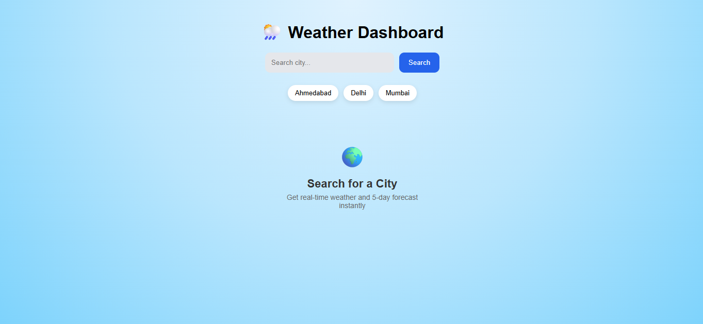
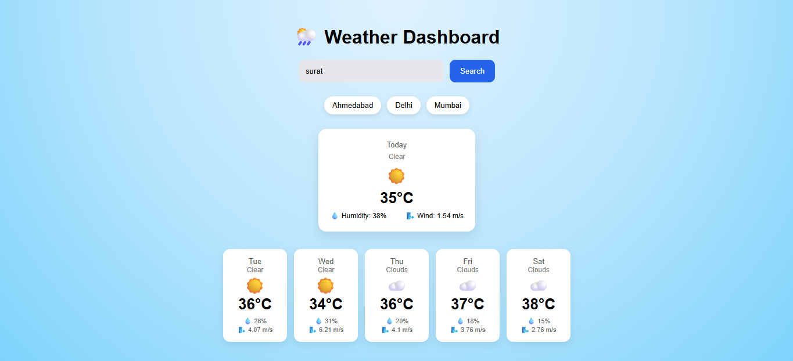

# Weather Dashboard

A modern weather application built with React and Redux that provides real-time weather data and a 5-day forecast for any city worldwide.

---

## Live Demo
https://weather-dashboard-xi-steel.vercel.app/

---

## Features

- Search weather for any city  
- 5-day weather forecast  
- Real-time temperature  
- Humidity & wind details  
- Quick city buttons (Ahmedabad, Delhi, Mumbai)  
- Input validation & error handling  
- Loading state for better user experience  

---

## Tech Stack

- React (Vite)
- Redux Toolkit
- OpenWeather API
- JavaScript
- HTML
- CSS

---

## Screenshots

### Home Screen


### Weather Results


---

## ⚙️ Installation

Clone the repository:

```bash
git clone https://github.com/dhwani1006/weather-dashboard.git
cd weather-dashboard
